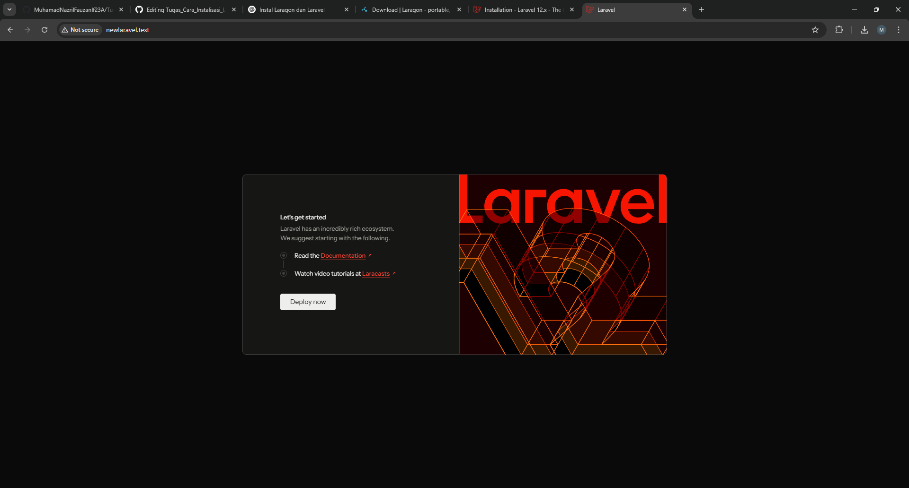

# Tugas_Cara_Instalisasi_Laravel

1. Pertama-tama Kita Install dulu Laragon

Link download laragon [https://laragon.org/download/](https://laragon.org/download/)
Klik tombol Download.
Pilih versi "Laragon Full" (sudah termasuk Apache, MySQL, PHP, dll).

2. Install Laragon

Jalankan file installer (.exe) yang telah diunduh.
Ikuti petunjuk instalasi, bisa menggunakan pengaturan default.
Setelah selesai, jalankan Laragon.

3. Cek apakah Laragon berhasil berjalan
   
Klik tombol Start All untuk menyalakan Apache & MySQL.
Buka browser, ketik http://localhost → seharusnya muncul halaman Laragon default.

4. Pastikan Composer sudah terpasang
   
Composer biasanya sudah otomatis ikut terinstal lewat Laragon.
Buka Terminal Laragon (Menu → Terminal).
Cek composer:

Jika sudah seperti gambar dibawah maka bisa ke Langkah selanjutnya

5.Instal laravel
Jalankan Laragon.
Klik Menu → Terminal atau buka cmd/PowerShell biasa (pastikan Composer terdeteksi).

6. Install Laravel secara global
Agar bisa menggunakan perintah laravel new, jalankan:

7. Cek apakah Laravel sudah terinstall
Ketik di terminal:
laravel --version
Kalau muncul versi Laravel, berarti berhasil 

8. Buat project baru menggunakan composer
Buat project dengan Composer langsung dengan perintah:

9. Akses Project di Browser
Karena Laragon otomatis buat virtual host, kita bisa langsung akses:  NEWLARAVEL.test
Ini sesuaikan dengan nama project kita
Jika sudah seperti ini, maka Laravel berhasil dibuat

